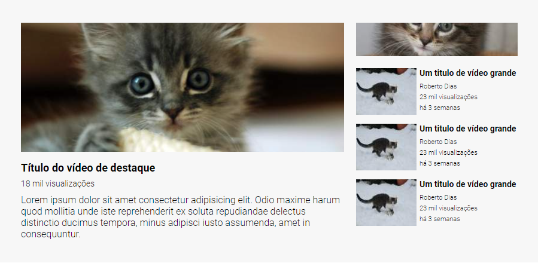

# Layout-Youtube

Desafio do curso para entender e melhorar as utilização das propriedades de Flexbox e Grid.

A ideia era criar um layout parecido com o do youtube com duas colunas e  usando o flex para centralizar os itens corretamente, principalmente o menu dos recomendados.

